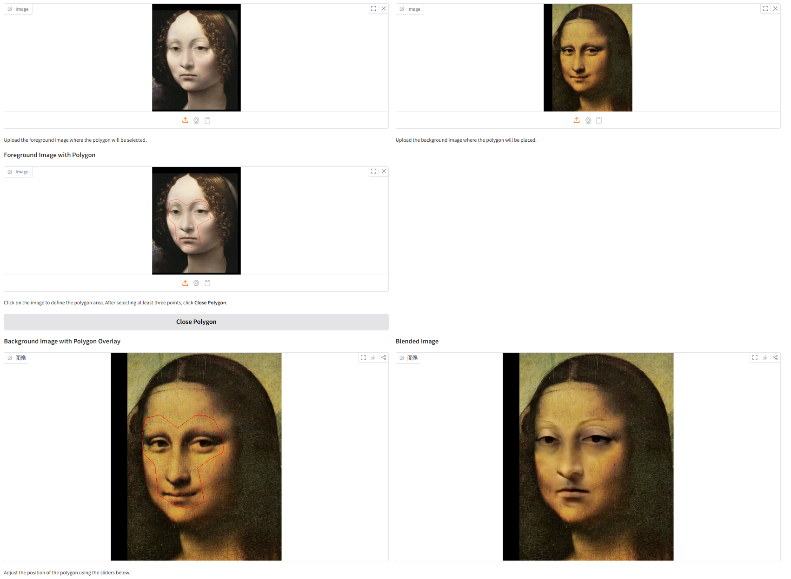
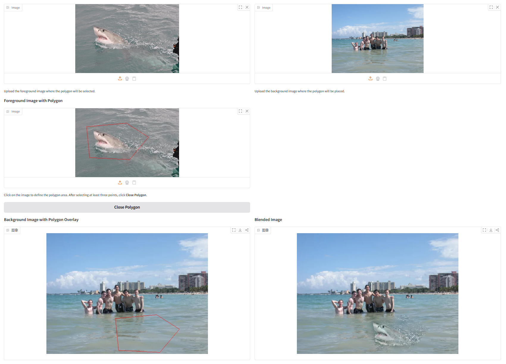
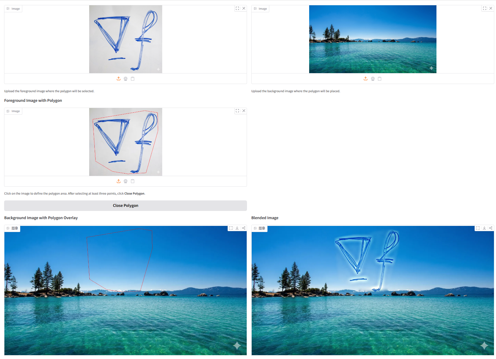
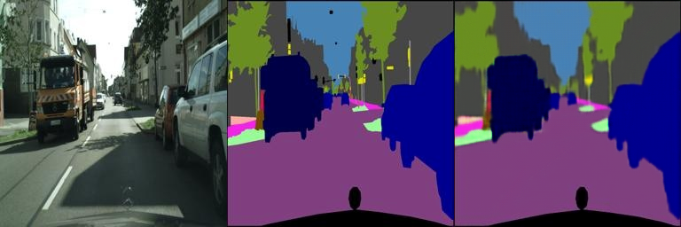
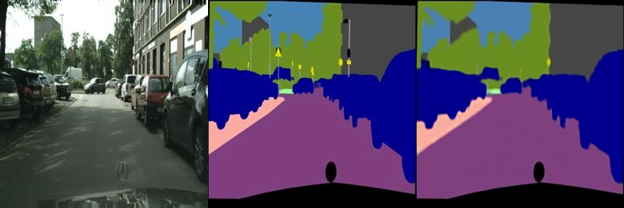
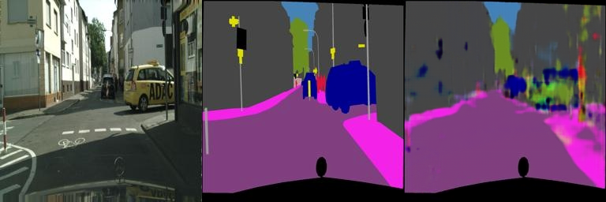
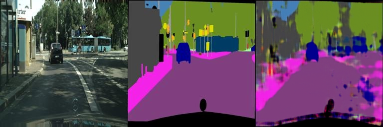
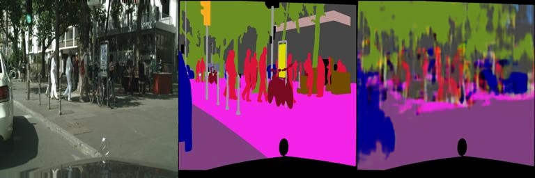
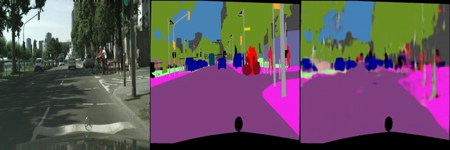

# Assignment 2 - DIP with PyTorch
## Implementation of traditional DIP (Poisson Image Editing) and deep learning-based DIP (Pix2Pix) with PyTorch.

This repository is Chen, Yuxi's implementation of Assignment_02 of DIP. 

## Requirements

To install requirements:

```setup
python -m pip install -r requirements.txt
```

## Running

To run Poisson Image Editing, run:

```basic
python run_blending_gradio.py
```

To run Pix2Pix, run:

```bash
bash download_dataset.sh cityscapes
python train.py
```

## Results
### Poisson Image Editing:




### Pix2Pix:
### Train Results






### Val Results






### Resources:
- [Assignment Slides](https://pan.ustc.edu.cn/share/index/66294554e01948acaf78)  
- [Paper: Poisson Image Editing](https://www.cs.jhu.edu/~misha/Fall07/Papers/Perez03.pdf)
- [Paper: Image-to-Image Translation with Conditional Adversarial Nets](https://phillipi.github.io/pix2pix/)
- [Paper: Fully Convolutional Networks for Semantic Segmentation](https://arxiv.org/abs/1411.4038)
- [PyTorch Installation & Docs](https://pytorch.org/)
