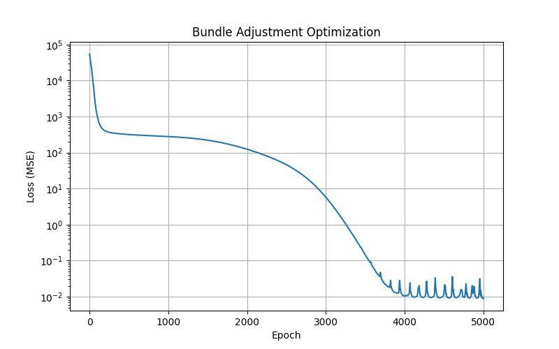

# Assignment 3 - Bundle Adjustment

### This repository is Chen, Yuxi's implementation of Assignment_03 of DIP: (1) implement Bundle Adjustment from scratch using PyTorch, and (2) use COLMAP to perform full 3D reconstruction from multi-view images.

### Resources:
- [Teaching Slides](https://pan.ustc.edu.cn/share/index/66294554e01948acaf78)
- [Bundle Adjustment — Wikipedia](https://en.wikipedia.org/wiki/Bundle_adjustment)
- [PyTorch Optimization](https://pytorch.org/docs/stable/optim.html)
- [pytorch3d.transforms](https://pytorch3d.readthedocs.io/en/latest/modules/transforms.html)
- [COLMAP Documentation](https://colmap.github.io/)
- [COLMAP Tutorial](https://colmap.github.io/tutorial.html)

---

### Background

一个 3D 头部模型的表面上采样了 20000 个 3D 点，并从 50 个不同视角将这些点投影到 2D 图像上。你的任务是：仅根据这些 2D 观测，通过优化恢复出 **3D 点坐标、相机参数和焦距** — 这就是经典的 Bundle Adjustment 问题。

### Data

```
data/
├── images/              # 50 rendered views (1024×1024), for visualization & COLMAP
├── points2d.npz         # 2D observations: 50 keys ("view_000" ~ "view_049"), each (20000, 3)
└── points3d_colors.npy  # per-point RGB colors (20000, 3), for result visualization
```

`points2d.npz` 中每个 view 的数据形状为 **(20000, 3)**，每行格式为 `(x, y, visibility)`：
- `x, y`：该点在该视角下的像素坐标
- `visibility`：1.0 表示该点在该视角下可见，0.0 表示被遮挡

### Known Information

| 参数 | 值 | 说明 |
|------|-----|------|
| Image Size | 1024 × 1024 | 图像分辨率 |
| Num Views | 50 | 视角数量（正前方 ±70° 范围） |
| Num Points | 20000 | 3D 点数量 |

---

## Task 1: Implement Bundle Adjustment with PyTorch

用 PyTorch 实现 Bundle Adjustment 优化，从 2D 观测恢复：
1. **相机内参**：焦距 f（所有相机共享）
2. **每个相机的外参** (Extrinsics)：旋转 R 和平移 T（共 50 组）
3. **所有 3D 点的坐标** (X, Y, Z)（共 20000 个）

## Requirements
To install requirements:

```setup
python -m pip install -r requirements.txt
```

## Running

To run bundle adjustment, run:

```
python bundle_adjustment.py
```

### Results

### Reconstructed 3D Point Cloud


### Loss Curve


## Task 2: 3D Reconstruction with COLMAP

使用 [COLMAP](https://colmap.github.io/) 命令行工具，对 `data/images/` 中的 50 张渲染图像进行完整的三维重建。

#### 具体步骤：

1. **特征提取** (Feature Extraction)
2. **特征匹配** (Feature Matching)
3. **稀疏重建** (Sparse Reconstruction / Mapper) — 即 COLMAP 内部的 Bundle Adjustment
4. **稠密重建** (Dense Reconstruction) — 包括 Image Undistortion、Patch Match Stereo、Stereo Fusion
5. **结果展示** — 在报告中展示稀疏点云或稠密点云的截图（可使用 [MeshLab](https://www.meshlab.net/) 查看 `.ply` 文件）

完整的命令行脚本见 [run_colmap.sh](run_colmap.sh)，可参考 [COLMAP CLI Tutorial](https://colmap.github.io/cli.html) 了解各步骤详情。

## Requirements
To install requirements:

```setup
conda install -c conda-forge colmap
```

## Running

To run 3D Reconstruction with COLMAP, run:

```
bash run_colmap.sh
```

**Result (reconstructed 3D point cloud):**


