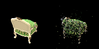
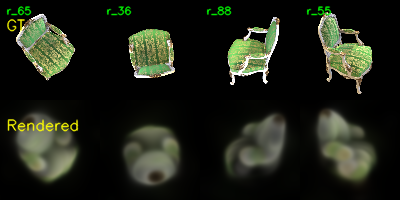
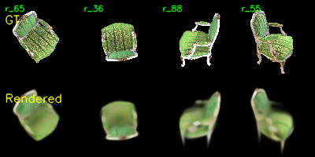
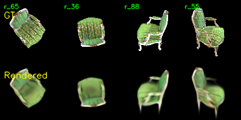
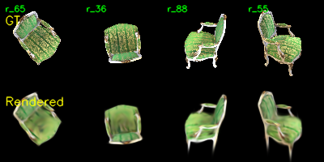
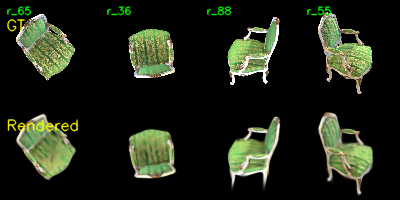
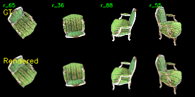
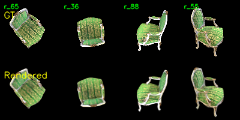
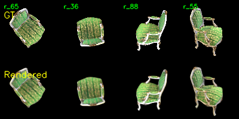

# Assignment 4 - Implement Simplified 3D Gaussian Splatting

### Resources:
- [Paper: 3D Gaussian Splatting for Real-Time Radiance Field Rendering](https://repo-sam.inria.fr/fungraph/3d-gaussian-splatting/3d_gaussian_splatting_low.pdf)
- [3DGS Official Implementation](https://github.com/graphdeco-inria/gaussian-splatting)
- [COLMAP — Structure-from-Motion](https://colmap.github.io/)
- [Teaching Slides](https://pan.ustc.edu.cn/share/index/66294554e01948acaf78)

---

### Background

3D Gaussian Splatting 将场景表示为一组带颜色和不透明度的 3D 高斯，通过将其投影到图像平面做 α-blending 实现可微体渲染。本作业实现一个**简化版** 3DGS（不含 tile-based rasterizer 和 adaptive densification），完整体验 pipeline：相机参数恢复 → 3D 高斯参数化 → 投影 → α-blending。

### Data

```
data/
├── chair/images/   # 100 张 multi-view 渲染图像
└── lego/images/    # 100 张 multi-view 渲染图像
```

---

## Task 1: Structure-from-Motion with COLMAP

使用 COLMAP 恢复相机内外参，并得到一组稀疏 3D 点作为 3DGS 的初始化：

```bash
python mvs_with_colmap.py --data_dir path/to/data
```

将恢复的 3D 点重投影回各视角进行验证：

```bash
python debug_mvs_by_projecting_pts.py --data_dir path/to/data
```

得到的部分结果如下：

<table align="center">
  <tr>
    <td align="center">
      
    </td>
    <td align="center">
      
    </td>
    <td align="center">
      
    </td>
  </tr>
  <tr>
    <td align="center">
      
    </td>
    <td align="center">
      
    </td>
    <td align="center">
      
    </td>
  </tr>
</table>

---

## Task 2: Simplified 3D Gaussian Splatting (主要部分)

观察 Task 1 的输出可以发现，COLMAP 恢复的 3D 点对于稠密渲染来说过于稀疏。我们将每个点扩展为一个 3D 高斯，使其覆盖周围空间。

### 2.1 3D Gaussian Initialization

参考 paper 公式 (6)：协方差矩阵由缩放矩阵 *S* 和旋转矩阵 *R* 构造。每个高斯需要以下可优化参数：

| 参数 | 说明 |
|------|------|
| Position μ | 初始化为 SfM 3D 点 |
| Rotation R | 用单位四元数参数化 |
| Scaling S | 3 维向量 |
| Opacity o | 标量 |
| Color c | RGB 三通道 |

[gaussian_model.py#L32](gaussian_model.py#L32) 中实现这些参数的初始化。

[gaussian_model.py#L103](gaussian_model.py#L103) 中由四元数和缩放参数构造3D 协方差矩阵。

### 2.2 Project 3D Gaussians to 2D

参考 paper 公式 (5)，将 3D 高斯投影到图像平面需要：

- 世界到相机的变换矩阵 *W*
- 投影变换的雅可比矩阵 *J*

投影后的 2D 协方差为 $\Sigma' = J W \Sigma W^T J^T$。

[gaussian_renderer.py#L26](gaussian_renderer.py#L26) 中实现 3D → 2D 投影。

### 2.3 Compute 2D Gaussian Values

2D Gaussian 在像素 $\mathbf{x}$ 处的取值：

$$
f(\mathbf{x}; \boldsymbol{\mu}_i, \boldsymbol{\Sigma}_i) = \frac{1}{2\pi\sqrt{|\boldsymbol{\Sigma}_i|}} \exp\left(P_{(\mathbf{x},i)}\right), \quad P_{(\mathbf{x},i)} = -\frac{1}{2}(\mathbf{x} - \boldsymbol{\mu}_i)^T \boldsymbol{\Sigma}_i^{-1} (\mathbf{x} - \boldsymbol{\mu}_i)
$$

其中 **μᵢ** 与 **Σᵢ** 为投影后的 2D 高斯中心与协方差。

[gaussian_renderer.py#L61](gaussian_renderer.py#L61) 中计算 Gaussian 取值。

### 2.4 Volume Rendering via α-blending

给定 *N* 个按深度排序的 2D 高斯，每个高斯在像素 $\mathbf{x}$ 处的 alpha 与透射率为：

$$
\alpha_{(\mathbf{x}, i)} = o_i \cdot f(\mathbf{x}; \boldsymbol{\mu}_i, \boldsymbol{\Sigma}_i), \qquad T_{(\mathbf{x}, i)} = \prod_{j<i} (1 - \alpha_{(\mathbf{x}, j)})
$$

最终像素颜色由各高斯按 α-blending 累加（paper 公式 1-3）。

[gaussian_renderer.py#L83](gaussian_renderer.py#L83) 中实现最终渲染。

### Train your 3DGS

启动训练：

```bash
python train.py --colmap_dir path/to/data --checkpoint_dir path/to/checkpoint
```

训练过程中部分对比图如下：
<table align="center">
  <tr>
    <td align="center">
      
      <br>
      <b>Epoch 0</b>
    </td>
    <td align="center">
      
      <br>
      <b>Epoch 5</b>
    </td>
    <td align="center">
      
      <br>
      <b>Epoch 10</b>
    </td>
  </tr>
  <tr>
    <td align="center">
      
      <br>
      <b>Epoch 20</b>
    </td>
    <td align="center">
      
      <br>
      <b>Epoch 40</b>
    </td>
    <td align="center">
      
      <br>
      <b>Epoch 80</b>
    </td>
  </tr>
  <tr>
    <td align="center">
      
      <br>
      <b>Epoch 120</b>
    </td>
    <td align="center">
      
      <br>
      <b>Epoch 150</b>
    </td>
    <td align="center">
      
      <br>
      <b>Epoch 199</b>
    </td>
  </tr>
</table>

### Render a Multi-view Video

训练完成后，可用 [render_3dgs_mv.py](render_3dgs_mv.py) 沿一个绕场景中心的**水平圆轨迹**渲染一段连续视角视频，便于直观检查重建质量：

```bash
python render_3dgs_mv.py \
    --colmap_dir path/to/data \
    --checkpoint path/to/checkpoint \
    --num_frames 240 --fps 30
# 默认输出: <colmap_dir>/render_mv.mp4
```

up 轴由训练相机的 y 轴平均自动估计（NeRF 合成数据图像均为正放），orbit 半径与高度取训练相机的均值。得到结果如下：

<table align="center">
  <tr>
    <td align="center">
      
    </td>
  </tr>
</table>

---

## Task 3: Compare with the Official 3DGS Implementation

本作业为纯 PyTorch 实现，训练速度与显存效率远不如官方实现，且未实现 adaptive Gaussian densification 等关键模块。使用相同数据集运行 [官方 3DGS](https://github.com/graphdeco-inria/gaussian-splatting)，从**渲染质量、训练速度、显存占用**三方面进行对比，并在报告中讨论差异来源。

### 两种方法对比

| 评估维度 | 简化版 3DGS (纯 PyTorch) | 官方 3DGS |
| :--- | :--- | :--- |
| **渲染质量 (Rendering Quality)** | 画面较模糊，存在明显空洞或高斯斑块，缺乏高频细节 | 图像清晰锐利，细节保留完整，物体表面具有视角相关的光泽效果 |
| **训练速度 (Training Speed)** | 极慢 (`1.75` it/s) | 极快 (约`97` it/s) |
| **显存占用 (VRAM Usage)** | 极高 (`13800` MiB) | 极低 (约`2500` MiB) |

### 差异来源讨论

通过对比纯 PyTorch 实现的简化版 3DGS 与官方完整版 3DGS，可以发现两者在渲染质量、训练速度和显存占用上存在巨大差异，主要原因可归结为以下几点：

**1. 渲染质量差异：自适应致密化与球谐函数**
* **缺乏 Adaptive Densification (自适应致密化)：** 简化版的高斯数量是固定的（受限于 SfM 初始化的点数）。当初始点云在某些区域过于稀疏时，单个高斯只能通过增大协方差（变得“又大又扁”）来强行覆盖空白区域，导致画面模糊或出现明显的斑块。官方实现会在训练过程中，根据梯度和位置信息动态地克隆或分裂高斯，从而在细节丰富的区域增加高斯密度，显著提升图像清晰度。
* **颜色表示方式的局限：** 简化版中每个高斯仅使用一个基础的 RGB 颜色值。而官方实现引入了球谐函数来拟合颜色，这使得模型能够捕捉到物体表面的高频细节以及视角相关的光泽和反射效果 ，极大增强了渲染的真实感。

**2. 训练速度差异：并行计算架构与底层优化**
* **Tile-based Rasterizer (基于图块的光栅化)：** 简化版的投影和 $\alpha$-blending 通常在全图范围内对高斯进行全局计算或简单的排序，计算复杂度极高。官方实现使用定制的 CUDA 核函数，将屏幕划分为 16x16 的 Tiles，并基于 CUB 库对高斯进行极速的基数排序。每个像素只与和它相交的高斯进行混合计算，剔除了大量无效操作。
* **Python/PyTorch 框架开销：** 纯 PyTorch 实现中，大量细粒度的张量操作在 Python 解释器层调用，无法像 CUDA C++ 编写的底层算子那样榨干 GPU 的极高并发计算能力，导致整体迭代速度缓慢。

**3. 显存占用 (VRAM) 差异：计算图与内存管理**
* **Autograd 机制带来的显存爆炸：** 在纯 PyTorch 实现中，为了进行反向传播更新参数，PyTorch 的 Autograd 机制必须在正向传播时将庞大的中间变量（例如所有 $N$ 个高斯在 $H \times W$ 分辨率下的投影属性、透明度等）保留在显存中。这导致显存需求随分辨率和高斯数量呈爆炸式增长。
* **CUDA 反向传播优化：** 官方的 CUDA 光栅化器在反向传播时，并没有存储所有的中间状态，而是利用巧妙的算法设计和 GPU 的共享内存 (Shared Memory)在 CUDA Kernel 内部实时重计算或复用数据，从而将峰值显存占用控制在了极低的水平。

---

